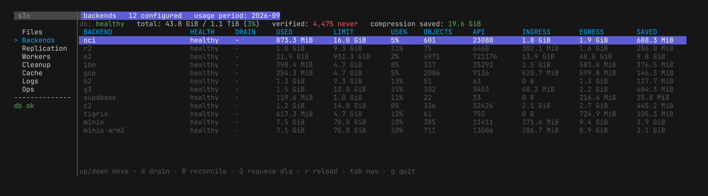
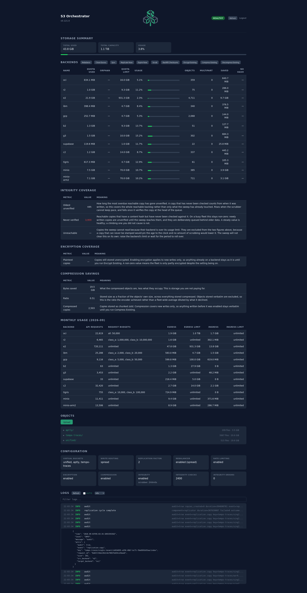

<p align="center">
  
</p>

# s3-orchestrator

[](https://github.com/afreidah/s3-orchestrator/actions/workflows/ci.yml)
[](https://sonarcloud.io/summary/new_code?id=afreidah_s3-orchestrator)
[](https://sonarcloud.io/summary/new_code?id=afreidah_s3-orchestrator)
[](https://opensource.org/licenses/MIT)

<p align="center">
  <strong><a href="https://s3-orchestrator.munchbox.cc">Project Website</a></strong> · <strong><a href="https://s3-orchestrator.munchbox.cc/docs/">Documentation</a></strong> · <strong><a href="https://s3-orchestrator.munchbox.cc/guides/maximizing-free-tiers/">Maximizing Free-Tier Storage</a></strong>
</p>

Most applications talk to one S3 backend, which ties them to that provider's uptime, pricing, and limits. s3-orchestrator puts a single S3 endpoint in front of any number of S3-compatible backends — OCI Object Storage, Backblaze B2, AWS S3, MinIO, Wasabi, Cloudflare R2, anything that speaks S3 — and presents them as one or more virtual buckets. It tracks where every object lives in its own database, which is what lets it enforce per-backend byte quotas, keep N copies across providers, fail reads over when one goes dark, and take a backend out of the fleet without downtime.

Clients see one endpoint and one namespace. The backends never learn the orchestrator exists — they see ordinary S3 calls, so any provider the AWS SDK can talk to works.

<p align="center">
  
</p>

<details>
<summary><strong>The web dashboard</strong> — storage summary, integrity and compression coverage, monthly usage against each provider's limits, object browser and live logs</summary>



</details>

## Who this is for

| Audience | Use case |
|---|---|
| **Homelabbers** | Stack free-tier allocations from multiple providers into usable storage without paying for a single plan. |
| **Self-hosters running MinIO** | Add automatic cloud backups to a local MinIO instance with one config change — no sync scripts or extra tooling. |
| **Small teams and startups** | Multi-cloud redundancy and encryption without the cost or complexity of enterprise storage platforms. |
| **Anyone wanting provider independence** | Applications talk S3 to one endpoint — swap, add, or remove backends without touching a line of code. |

## What it does

- **Backend quotas.** Each backend carries a byte limit and writes overflow to the next when it fills, so a 20 GB allocation and a 10 GB one become one 30 GB bucket. Monthly API-request, egress and ingress caps work the same way.
- **Replication.** Set a factor and every object lands on that many distinct backends. A background replicator makes the copies, or `write_path.parallel_copies` has the write claim its targets and upload to all of them at once, answering the client on the first copy committed — which spares the replicator a full GET of the object and the source backend's egress for every copy it would have made. Reads fail over to a surviving copy, a scrubber checks stored bytes against recorded hashes, and an over-replication worker trims the set when a recovered backend brings its copies back.
- **Access control.** A credential resolves to a user, and that user holds a grant on each resource it may reach: a virtual bucket for object access, a backend or the instance itself for the control plane. SigV4 and presigned URLs.
- **Object tagging.** Key/value labels stored with the object, always on. Inline on `PutObject` and `CreateMultipartUpload`, the three `?tagging` operations, and `x-amz-tagging-directive` on a server-side copy. Lifecycle rules can filter on a tag.
- **Encryption and compression.** Envelope encryption (AES-256-GCM; master key inline, in a file, or in Vault Transit) and chunked zstd compression. Both optional and transparent to clients; sizes, ETags and content hashes stay those of the object the client wrote. With both on, compression runs first, because ciphertext does not compress.
- **Terraform provider.** Published to the [Terraform](https://registry.terraform.io/providers/afreidah/s3-orchestrator/latest/docs) and [OpenTofu](https://search.opentofu.org/provider/afreidah/s3-orchestrator/latest) registries. Manages the buckets, users, credentials and grants a deployment serves.
- **Database.** Embedded SQLite with no external dependencies, single-node PostgreSQL, or many instances with Redis-backed shared counters so quotas hold across the fleet.
- **Operator tooling.** Online drain, rebalance, import of an existing bucket, integrity scrub, a cleanup queue with a dead-letter table, hot config reload, an admin API, a web dashboard and a terminal object browser.

## Moving providers without downtime

Point the orchestrator at the bucket you already have and import its objects into the metadata layer — nothing moves. Add the new provider and raise the replication factor, and the workers copy everything across while traffic keeps flowing. Once the copies are in place, drain the old backend and delete it from the config. No step takes the application down.

## What else is out there

If you've gone looking for a tool that does something similar, there don't appear to be many options:

| Project | What it is | Why it's not the same |
|---|---|---|
| **rclone `union` remote** | Client-side multi-remote stacking | Per-client config, no server endpoint, no central drain/rebalance/quota enforcement |
| **MinIO Gateway** | Was a multi-backend S3 proxy | [Deprecated in 2022](https://blog.min.io/deprecation-of-the-minio-gateway/) |
| **[Flexify.IO](https://flexify.io/multi-cloud)** | Commercial multi-cloud S3 SaaS | Closed source; $0.03/GiB SaaS or $0.09/hr self-hosted |
| **[gaul/s3proxy](https://github.com/gaul/s3proxy)**, **[oxyno-zeta/s3-proxy](https://oxyno-zeta.github.io/s3-proxy/)** | S3 API translation / routing proxies | Single backend at a time, or multi-bucket routing without quotas, replication, or a metadata layer |

## Quickstart

**Prerequisites:** Go 1.27+, Docker, Make.

```bash
git clone https://github.com/afreidah/s3-orchestrator.git
cd s3-orchestrator
make run
```

Starts three MinIO backends via Docker Compose, embedded SQLite as the metadata store, and the orchestrator on `localhost:9000`.

```bash
aws --endpoint-url http://localhost:9000 s3 cp /etc/hostname s3://photos/test.txt
aws --endpoint-url http://localhost:9000 s3 ls s3://photos/
```

Default credentials: access key `photoskey`, secret `photossecret`. Web dashboard at [localhost:9000/ui/](http://localhost:9000/ui/) (login `admin` / `admin`).

Full credentials and troubleshooting: [docs/quickstart.md](docs/quickstart.md).

## Install

| Channel | Source |
|---|---|
| Container | `docker pull ghcr.io/afreidah/s3-orchestrator:<version>` |
| Debian / Ubuntu | `.deb` from [GitHub Releases](https://github.com/afreidah/s3-orchestrator/releases) |
| Static binary | Linux / macOS / Windows from [GitHub Releases](https://github.com/afreidah/s3-orchestrator/releases) |
| From source | `git clone && make build` |
| Terraform provider | [`afreidah/s3-orchestrator`](https://registry.terraform.io/providers/afreidah/s3-orchestrator/latest/docs) on the Terraform Registry, or the [OpenTofu Registry](https://search.opentofu.org/provider/afreidah/s3-orchestrator/latest) |

**Database:** SQLite is embedded — no external dependencies for single-instance use. PostgreSQL 14+ is also an option and is required for multi-instance deployments (`database.driver: postgres`); the schema migrates on boot.

**Generate a config interactively:** `s3-orchestrator init`.

### Verify release artifacts

Container images and release checksums are signed with [cosign](https://github.com/sigstore/cosign) (keyless / Sigstore):

```bash
# Container image
cosign verify ghcr.io/afreidah/s3-orchestrator:<version> \
  --certificate-identity-regexp='github\.com/afreidah/s3-orchestrator' \
  --certificate-oidc-issuer='https://token.actions.githubusercontent.com'

# Release checksums
cosign verify-blob checksums.txt --bundle checksums.txt.bundle \
  --certificate-identity-regexp='github\.com/afreidah/s3-orchestrator' \
  --certificate-oidc-issuer='https://token.actions.githubusercontent.com'
```

## Architecture in 30 seconds

```
              S3 clients (aws cli, rclone, etc.)
                          |
                          v
                    +-----------+
                    | S3 Orch.  |  <-- SigV4 auth, rate limiting, quota routing
                    +-----------+
                     |         |
            +--------+         +------------------+------------------+
            v                  v                  v                  v
       PostgreSQL        OCI Object         Backblaze B2          AWS S3
       (metadata)       Storage (20 GB)       (10 GB)             (5 GB)
                              \                  |                  /
                               '------------ 35 GB total ---------'
```

Metadata (object locations, quota counters, multipart state, cleanup queue) lives in PostgreSQL or SQLite. Backends only ever see plain S3 calls — no orchestrator-specific protocol, no schema requirements. Any provider that speaks the AWS SDK works.

Deeper details: [docs/architecture.md](docs/architecture.md).

## Documentation

| Topic | Doc |
|---|---|
| First-run / demo | [Quickstart](docs/quickstart.md) |
| S3 client setup | [User Guide](docs/user-guide.md) |
| Architecture | [docs/architecture.md](docs/architecture.md) |
| Configuration walkthrough + hot-reload | [docs/configuration.md](docs/configuration.md) |
| Authentication (SigV4, tokens, multi-bucket) | [docs/authentication.md](docs/authentication.md) |
| Backends, quotas, routing strategies | [docs/backends.md](docs/backends.md) |
| Database engines, schema, migrations | [docs/database.md](docs/database.md) |
| Replication, over-replication, orphan reconciliation | [docs/replication.md](docs/replication.md) |
| Cleanup queue, lifecycle expiry, pending intents | [docs/cleanup-and-lifecycle.md](docs/cleanup-and-lifecycle.md) |
| Envelope encryption, Vault Transit | [docs/encryption.md](docs/encryption.md) |
| At-rest compression (chunked zstd) | [docs/compression.md](docs/compression.md) |
| Object tagging (key/value labels) | [docs/tagging.md](docs/tagging.md) |
| Operations (drain, rebalance, scrub, cache, trace) | [docs/operations.md](docs/operations.md) |
| Monitoring (Prometheus, OTel, audit log) | [docs/monitoring.md](docs/monitoring.md) |
| Background services reference | [docs/background-services.md](docs/background-services.md) |
| Webhook notifications | [docs/notifications.md](docs/notifications.md) |
| CLI subcommands | [docs/cli.md](docs/cli.md) |
| Provisioning buckets and identities with Terraform | [Guide](https://s3-orchestrator.munchbox.cc/guides/terraform-provider/) · [Terraform Registry](https://registry.terraform.io/providers/afreidah/s3-orchestrator/latest/docs) · [OpenTofu Registry](https://search.opentofu.org/provider/afreidah/s3-orchestrator/latest) |
| UI + Admin API JSON endpoints | [docs/api-reference.md](docs/api-reference.md) |
| Deployment (Nomad, Kubernetes, Docker) | [docs/deployment.md](docs/deployment.md) |
| Security hardening | [docs/security-hardening.md](docs/security-hardening.md) |
| Performance tuning | [docs/performance-tuning.md](docs/performance-tuning.md) |
| Disaster recovery | [docs/disaster-recovery.md](docs/disaster-recovery.md) |
| Version migration | [docs/version-migration.md](docs/version-migration.md) |
| Benchmark trends | [Live charts](https://afreidah.github.io/s3-orchestrator/dev/bench/) · [scheduled runs](https://github.com/afreidah/s3-orchestrator/actions/workflows/benchmarks.yml) |
| Coding conventions | [docs/style-guide.md](docs/style-guide.md) |
| Build / test / contribute | [CONTRIBUTING.md](CONTRIBUTING.md) |

## Contributing

Contributions welcome. Start with [CONTRIBUTING.md](CONTRIBUTING.md) for the build / test / submit workflow, and [docs/style-guide.md](docs/style-guide.md) for the codebase's conventions.

## License

[MIT](LICENSE)
